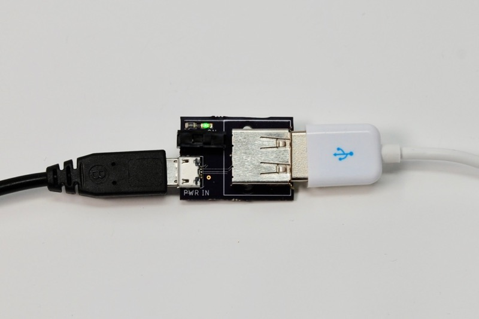
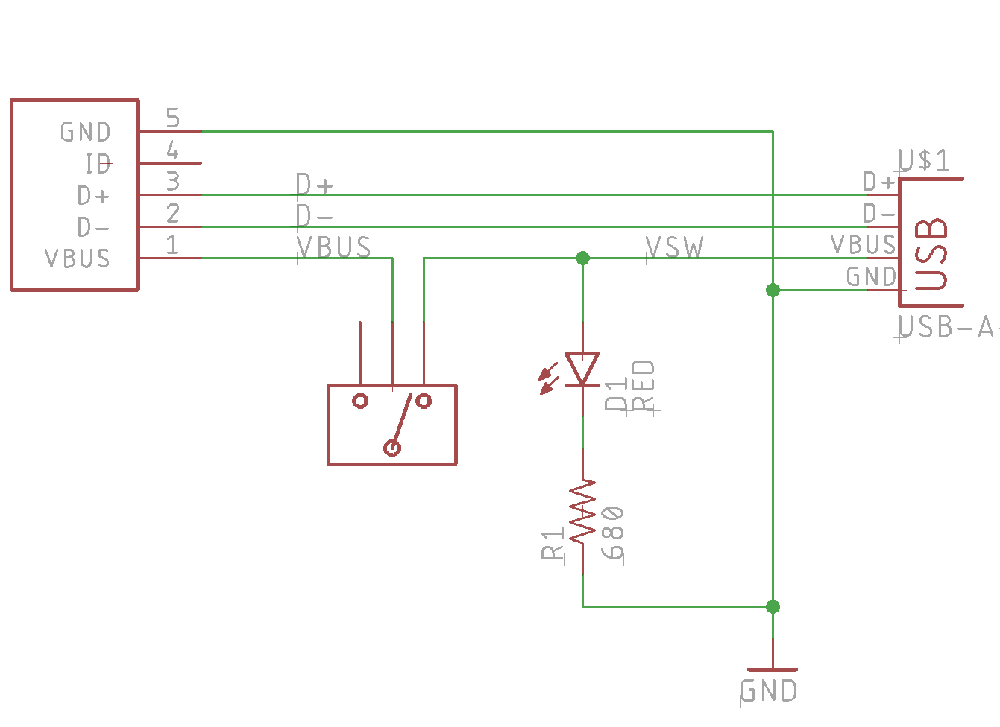
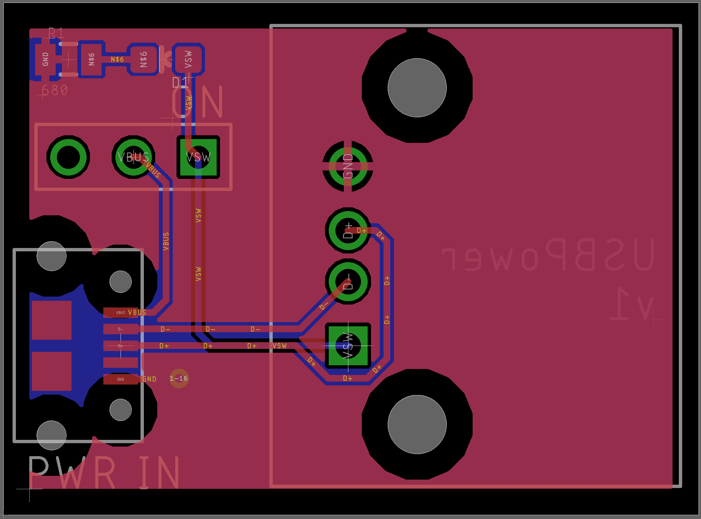

# USB Power Switch

*Simple board that disconnects power from a USB connection while maintaining data and GND*

On the Argon and Xenon Particle boards in particular, it's not a good idea to power by USB and the VUSB pin at the same time, as there is no protection diode to prevent power from your power supply from affecting the USB, or vice versa.

While power-only USB cables are common, data-only cables are not. I made this little board to allow the power to be easily disconnected. 

## BOM

| Description | Example |
| --- | --- |
| CONN USB MICRO B RECPT SMT R/A | [Amphenol FCI 10118194-0001LF](https://www.digikey.com/products/en?keywords=609-4618-1-nd) |
| USB-A Receptacle | [Amphenol 87520-0010BLF](https://www.digikey.com/products/en?keywords=609-1045-ND) |
| SWITCH SLIDE SPDT 200MA 30V | [E-Switch EG1218](https://www.digikey.com/product-detail/en/e-switch/EG1218/EG1903-ND/101726) |
| Green 572nm LED 2V 5 mA 0603 | [Lite-On LTST-C193KGKT-5A](https://www.digikey.com/product-detail/en/lite-on-inc/LTST-C193KGKT-5A/160-1828-1-ND/2356247) |
| RES SMD 680 OHM 5% 1/8W 0805 | [Panasonic ERJ-6GEYJ681V](https://www.digikey.com/product-detail/en/panasonic-electronic-components/ERJ-6GEYJ681V/P680ACT-ND/90033) |

